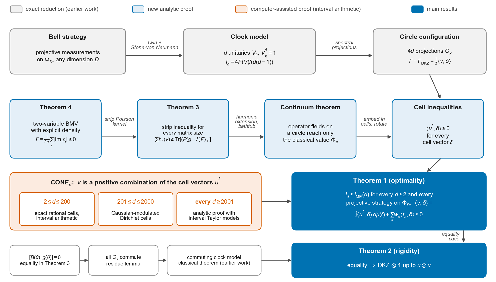

# IQOQI Vienna Open Problem 27: a complete resolution

The DKZ measurements are optimal and unique for CGLMP on maximally entangled states in every dimension, and every
remaining clause of the problem as posed is settled.

**Authors:** Ansh Mishra, Aryan Senthilkumar. **License:** MIT.

This repository completes the resolution of IQOQI Vienna Open Quantum Problem 27,
[*The power of CGLMP inequalities*](https://oqp.iqoqi.oeaw.ac.at/the-power-of-cglmp-inequalities)
([archived copy](http://web.archive.org/web/20231029013544/https://oqp.iqoqi.oeaw.ac.at/the-power-of-cglmp-inequalities)),
as originally posed. Part A was answered by Bancal, Gisin and Pironio in 2010. For Part B we prove the central clause
(the DKZ measurements are necessarily the optimal ones, in every dimension) and settle its two remaining clauses: noise
resistance and Kullback–Leibler discrimination. The proofs, the computer-assisted certificates, the independent
verifications and a Lean 4 formalisation are all included. The clause-by-clause verdicts are in
[`complete-resolution/LEDGER.md`](complete-resolution/LEDGER.md).

## In one paragraph

Two distant parties, Alice and Bob, share a maximally entangled pair of d-level systems. Each of them picks one of two
measurements and records one of d outcomes. The Collins–Gisin–Linden–Massar–Popescu (CGLMP) inequality is the standard
test of whether their correlations could have a local explanation. Since 2001 the best known quantum strategy has been the
Fourier-type measurements of Durt, Kaszlikowski and Żukowski (DKZ), which reach the value
I_ME(d) = 4/(d(d−1)) · Σ_{j=1}^{d−1} (d−j) sec(πj/(2d)). Numerics never found anything better, but whether this holds in
general was an open problem. **We prove that for every number of outcomes d, every local dimension D, and all projective
measurements on the maximally entangled state, no strategy beats DKZ. We also prove that DKZ is the only optimal strategy,
up to a local change of basis and an inert auxiliary system.**

## Papers

| | |
|---|---|
| [`papers/overview/main.pdf`](papers/overview/main.pdf) | the article: the problem, the result and the ideas, with figures, written for a general physics audience (21 pages) |
| [`papers/overview/SI.pdf`](papers/overview/SI.pdf) | Supplementary Information to the article (21 pages) |
| [`papers/math/main.pdf`](papers/math/main.pdf) | the complete mathematical paper with all proofs (51 pages) |
| [`papers/arxiv/main.pdf`](papers/arxiv/main.pdf) | the arXiv preprint: a self-contained account of the complete resolution, with the proofs of the new clauses (22 pages; upload source `papers/arxiv/arxiv_source.zip`) |

## Main results

- **Theorem 1 (optimality, every d ≥ 2).** For every local dimension D and all projective measurements on the maximally
  entangled state Φ_D, the CGLMP value satisfies I_d ≤ I_ME(d). The DKZ measurements attain this value.
- **Theorem 2 (rigidity / self-testing, every d ≥ 2).** If projective measurements on Φ_D attain I_ME(d), then d divides D,
  and up to a local unitary u ⊗ ū the strategy is DKZ ⊗ 1. If d does not divide D, the maximum on Φ_D is strictly below I_ME(d).
- **Theorem 3 (a strip inequality for projections, every matrix size M).** Let B be an orthogonal projection on C^M,
  P = 1 − B, g Hermitian and λ real. Let h_λ be the harmonic function on the strip 0 < Re ν < 1 with boundary values (Im ν − λ)_+
  on the left edge and 0 on the right edge. Then
  Σ_{ν ∈ spec(B + ig)} h_λ(ν) ≥ Tr[(P(g − λ)P)_+],
  with an exact formula for the difference, which is zero only when B and g commute.
- **Theorem 4 (a two-variable Bessis–Moussa–Villani theorem for projections).** The function
  Tr e^{ag − tP} − e^{−t} Tr_P e^{aPgP} − Tr_B e^{aBgB} equals a² times the Laplace transform of the explicit nonnegative
  density F(s,τ) = (1/2π) Σ_i |Im x_i(s,τ)|, where the x_i are the roots of det(g − s − x(P − τ)).
- **Theorem 5 (the cone condition CONE_d, every d; computer-assisted).** An explicit vector lies in the convex cone generated by
  cell-embedding vectors built from Clausen functions. This is certified in interval arithmetic for 2 ≤ d ≤ 2000, and proved for
  all d ≥ 2001 by a uniform argument with certified error bounds.

Theorems 3 and 4 are proved analytically; Theorems 1 and 2 use them together with Theorem 5.

## Status of OQP 27 after this work

| Clause (as posed) | Verdict | Where |
|---|---|---|
| 27A: are all facets of the (2,2,d) local polytope of CGLMP type? | **no** | Bancal, Gisin, Pironio, J. Phys. A 43, 385303 (2010) (prior work) |
| 27B: the DKZ measurements are necessarily the optimal ones on maximally entangled states | **true for every d** (optimal and unique; projective measurements, any local dimension) | Theorems 1 and 2, `papers/`, `lean/` |
| 27B: they give the highest resistance of the violation to noise | **depends on the reading.** Resistance of the *CGLMP* violation: **true for every d**, DKZ the unique optimum. Gill's literal reading (uniform random outcomes, violation of *local realism*): **false for every d ≥ 4** | `complete-resolution/noise-cglmp/` (Lean-verified), `complete-resolution/noise-literal/` (exact theorem, two independent verifications) |
| 27B: they give the best Kullback–Leibler discrimination | **false for every d ≥ 4** | `complete-resolution/kl-divergence/` (d = 4 first by Y. Zhang, Zenodo 2026, doi:10.5281/zenodo.23022433) |

For the literal noise clause, the effect behind the counterexample was observed before: Acín, Durt, Gisin and Latorre,
PRA 65, 052325 (2002), eq. (14), and numerically Baek, Ryu and Lee, New J. Phys. 27, 053001 (2025). As far as we found,
the exact theorem for every d ≥ 4 and its connection to Problem 27 are new.

Questions that go beyond the problem as posed remain open, and we do not claim them: optimality for general POVMs when
d >= 9 (for d = 3, ..., 8 it is proved, with uniqueness, by exact certificates in `complete-resolution/povm/`); noise
resistance against all Bell inequalities with white noise on the state (DKZ is optimal in all our numerical searches up to
d = 8, and d = 3 is proved); and the CGLMP maximum over all states for d ≥ 9 (exact for d ≤ 8).

Scope of Theorems 1 and 2: projective measurements (PVMs), as in the problem's "observables". For d = 3, ..., 8 the
same holds for arbitrary POVMs, in every local dimension ([`complete-resolution/povm/`](complete-resolution/povm/)); for
d >= 9 general POVMs are not covered.

## How the proof fits together

1. **Reduction** (exact, earlier work, now formalised in Lean): every strategy becomes a family of order-four unitaries (a
   "clock model"), and then a configuration of 4d projections on a circle, whose CGLMP deficit is a linear form ⟨v, δ⟩.
2. **Strip inequality** (Theorem 3, new): proved for every matrix size through the explicit positive density of Theorem 4.
3. **Continuum theorem and cell inequalities:** with Theorem 3, operator-valued fields on a circle can only reach the classical
   Stein–Weiss value; embedding the configuration into cells gives the inequalities ⟨u^ℓ, δ⟩ ≤ 0 for every cell vector ℓ.
4. **Cone condition** (Theorem 5, computer-assisted): v is a nonnegative combination of cell vectors u^ℓ, so ⟨v, δ⟩ ≤ 0.
5. **Rigidity:** equality forces every term to be tight, which forces all projections to commute, and the classical theorem of our
   earlier work then forces DKZ.

## Verification

### Formal verification in Lean 4

[`lean/`](lean/) contains a Lean 4 formalisation of the whole argument, built on Mathlib: 98 files, about 33,400 lines,
plus three files of algebraic rigidity from our earlier repository. It states the problem exactly (concrete matrices,
projective measurements, the CGLMP expression term by term) and proves it. Each main theorem below depends only on Lean's
three standard axioms (`propext`, `Classical.choice`, `Quot.sound`). The code contains no `sorry`, `admit`, `axiom` or
`native_decide`, and the certificates are evaluated by the Lean kernel itself (`decide +kernel`). A clean rebuild of every
file is logged in `lean/OQP27/logs/fullbuild/`, and `bash check.sh` in `lean/` repeats it ([`lean/README.md`](lean/README.md)).

| Lean theorem | What it says | Assumptions |
|---|---|---|
| `OQP27.maxEntClause_le_twenty` | for every 2 ≤ d ≤ 20: DKZ is optimal and unique (Theorems 1 and 2) and attains I_ME(d) | **none** |
| `OQP27.maxEntClause_all` | Theorems 1 and 2 for every d ≥ 2 | CONE_d for d ≥ 21 (`Hyp_ConeCertPos_large`) |
| `OQP27.stripInequality`, `OQP27.stripEquality` | Theorem 3 for every matrix size, and its equality case | **none** |
| `OQP27.StripL3b.theorem1_bmv2` | Theorem 4 (two-variable BMV with explicit density) | **none** |
| `OQP27.StripL3b.hyp_RI` | the Radon identity behind Theorem 4 | **none** |
| `OQP27.Red.hyp_reduction` | exact reduction: strategy → clock model → projection configuration → linear form | **none** |
| `OQP27.Cell.continuumCell` | continuum theorem: Theorem 3 implies all cell inequalities | **none** |
| `OQP27.ClassB.classicalTheoremB_all` | the classical (commuting) theorem, every d, including the discrete Hilbert-transform rearrangement | **none** |
| `OQP27.coneCertPos_le_twenty` | CONE_d for 2 ≤ d ≤ 20, with certificates re-evaluated by the Lean kernel | **none** |
| `OQP27.ConeCertificate.fullCheck_sound` | soundness of the certificate checker used for those cases | **none** |
| `OQP27.dkz_cglmp` | the DKZ strategy attains I_ME(d) for every d | **none** |
| `OQP27.cglmpOf_noisy`, `OQP27.noisy_violation_iff` | mixing with uniform noise at visibility v multiplies the CGLMP value by v; the CGLMP noise threshold of a strategy is 2/I_d | **none** |
| `OQP27.noisy_violation_imp_le_twenty`, `OQP27.noisy_violation_imp` | noise clause, CGLMP reading: no strategy has a lower CGLMP noise threshold than DKZ (2/I_ME(d)) | none for d ≤ 20; CONE_d for d ≥ 21 |

So, for 2 ≤ d ≤ 20, the maximally entangled clause of OQP 27B is fully machine-checked. For d ≥ 21 the Lean proof is complete
except for one input, the cone condition, which is established by interval-arithmetic certificates (next section).

What is proved on paper but not in Lean:
- the rigidity statement checked in Lean is "d divides D, and a local unitary u ⊗ ū maps the strategy to DKZ ⊗ 1". The
  uniqueness of u (up to 1 ⊗ u′) and the strict inequality when d does not divide D are proved in the papers.
- some auxiliary facts are used only as remarks: continuity of the density F, the sum rule ∫F ds = ‖BgP‖², and the
  dilogarithm formula for h_λ. In Lean, h_λ is defined as a Poisson integral and F needs only to be measurable.
- for d ≥ 201, CONE_d is certified first in integral form, as an expectation over a random-cell process. Passing to the finite
  form used in Lean takes a short Carathéodory argument, which is in the papers and in `cone-certificates/README.md`.

### Computer-assisted certificates (cone condition, d ≥ 21)

[`cone-certificates/`](cone-certificates/) contains the certificates, the checkers, the logs and the write-ups. There are three regimes:
- **d ≤ 200:** exact finite cone representations (rational cells, certified positive weights), verified by `verify_cone.py` in
  `mpmath` interval arithmetic.
- **201 ≤ d ≤ 2000:** one certificate per d from the single-run checker `verify_cert.py`. Each run uses one precision (160 bits),
  one code version (SHA-256 stored in every certificate) and one Poincaré–Miranda box. `audit_cert_g.py` checks all 1800 and
  reports 1800/1800 OK.
- **d ≥ 2001:** a uniform analytic argument with interval Taylor models and certified error terms (`CONE_ALLD_PROOF.md`,
  scripts `a01`–`a14`).

`python audit_alld.py` re-checks all three regimes and prints `ALL-D CERTIFIED`.

### Independent verification

Every analytic proof was checked by an independent referee, who also re-implemented the numerics from scratch. The reports
are kept next to the proofs:
- the strip inequality and Theorem 4: [`proofs/strip-inequality/`](proofs/strip-inequality/);
- the elementary proof of the Radon identity: [`proofs/radon-identity/`](proofs/radon-identity/);
- the reduction chain, the cone logic and rigidity: [`proofs/reduction-chain/`](proofs/reduction-chain/), [`proofs/rigidity/`](proofs/rigidity/);
- an alternative proof of Theorem 3 for rank-one B (hence for all M ≤ 5) by a different method:
  [`proofs/rank-one-alternative/`](proofs/rank-one-alternative/).

## Repository layout

| Path | Contents |
|---|---|
| `papers/overview/` | the article (`main.pdf`), its Supplementary Information (`SI.pdf`), LaTeX sources, figure scripts |
| `papers/math/` | the mathematical paper (`main.pdf`) and its LaTeX source |
| `papers/arxiv/` | the arXiv preprint (`main.pdf`), its LaTeX source, the upload archive and the arXiv metadata |
| `complete-resolution/` | the clause-by-clause ledger (`LEDGER.md`) and the theorems settling the noise and Kullback–Leibler clauses, with verifiers, certificates and independent verification reports |
| `lean/` | the Lean 4 formalisation (`OQP27/*.lean`, `CGLMPRigidity/*.lean`), `check.sh`, axiom audits, build logs, module reports |
| `cone-certificates/` | CONE_d certificates, interval-arithmetic checkers, audits, logs, and the write-ups `CONE_PROOF.md`, `CONE_ALLD_PROOF.md`, `RIGOR_GAUSS.md`, `RIGOR_ALLD.md` |
| `proofs/strip-inequality/` | proof of Theorems 3 and 4 (Fourier-slice route), independent verification report, numerical checks |
| `proofs/radon-identity/` | elementary, distribution-free proof of the Radon identity and hence of Theorems 3 and 4, report, checks |
| `proofs/rank-one-alternative/` | an independent proof of Theorem 3 for rank-one B, review, checks |
| `proofs/rigidity/` | proof of Theorem 2 for every d, checks |
| `proofs/reduction-chain/` | independent verification of the reduction chain and the cone logic, checks |

## Prior work and credits

- CGLMP inequality: Collins, Gisin, Linden, Massar, Popescu, PRL 88, 040404 (2002). DKZ measurements: Durt, Kaszlikowski, Żukowski,
  PRA 64, 024101 (2001); Kaszlikowski et al., PRL 85, 4418 (2000).
- Exact Tsirelson bounds for d = 3, 4 over all states: Ioannou and Rosset, arXiv:2112.10803.
- Bessis–Moussa–Villani conjecture: proved by H. Stahl, Acta Math. 211 (2013); exposition by A. Eremenko (2015).
  The Fourier-slice mechanism that produces a positive planar density was used by O. Heinävaara,
  *Tracial joint spectral measures*, arXiv:2310.03227, to give a new proof of Stahl's theorem; our Theorem 4 is a pinched,
  two-variable variant, and its application to the strip inequality is new as far as we know.
- Our earlier work on this problem: [github.com/anshM123/CGLMP](https://github.com/anshM123/CGLMP) (exact certificates for
  d = 3..20, the classical/commuting case for every d, Tsirelson bounds d = 3..8, Kullback–Leibler counterexamples).

## Citation

See [`CITATION.cff`](CITATION.cff).
